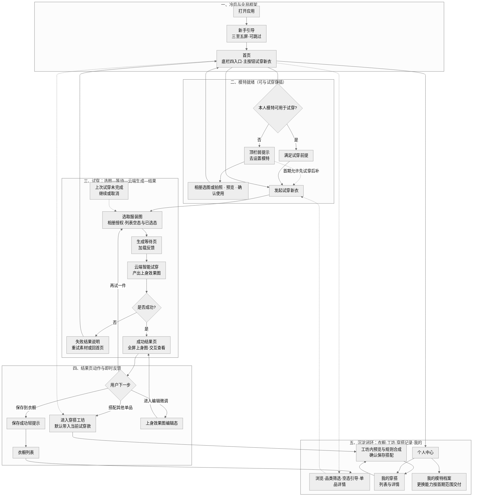
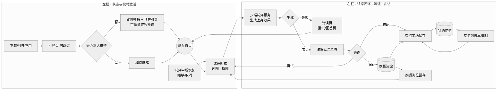
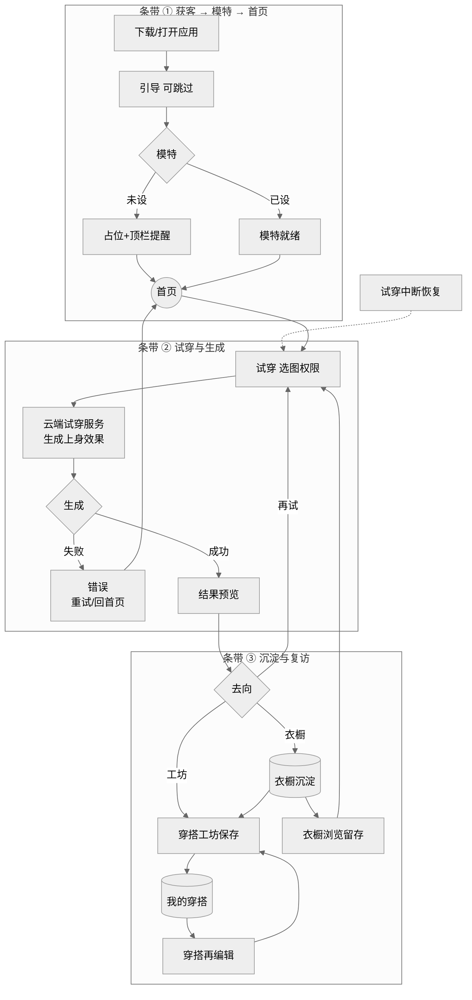
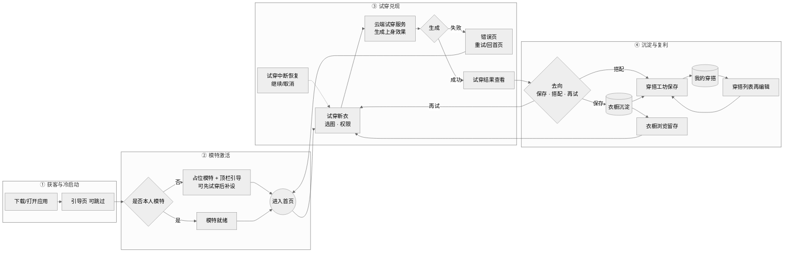
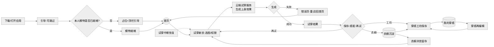
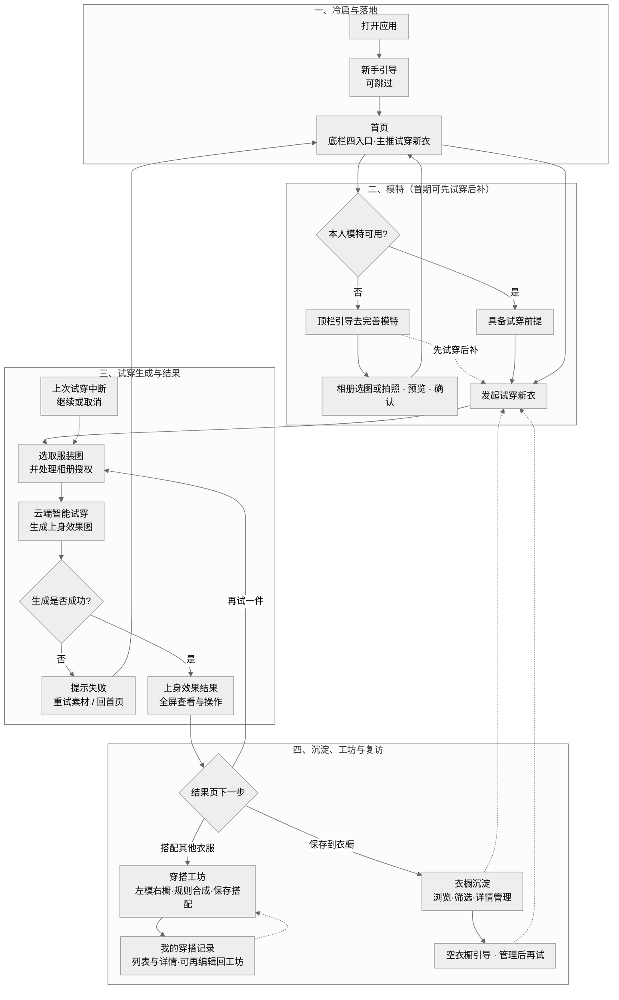
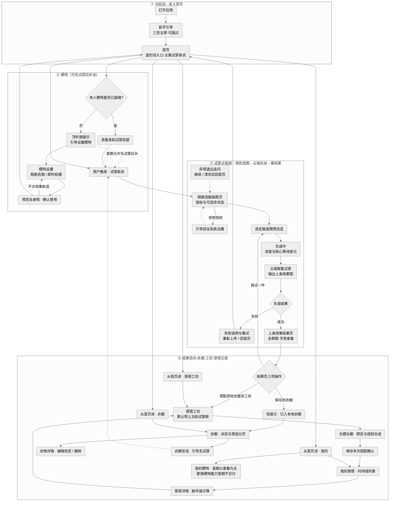
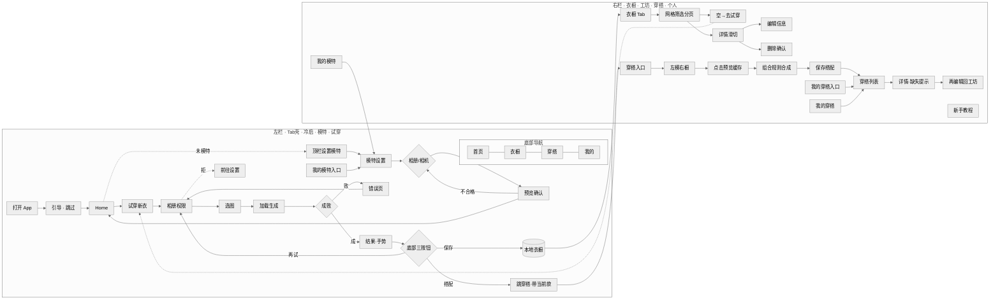
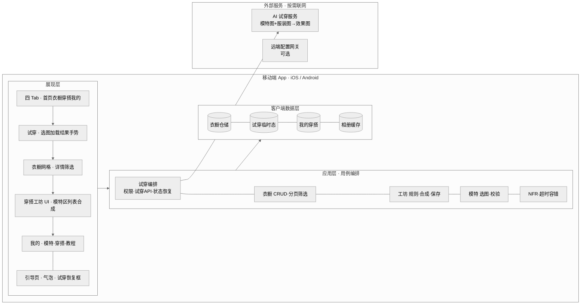

# AI 试穿 / 穿搭助手 — 业务流程图 · 功能流程图 · 产品架构图（MVP）

> 依据：`模块级用户流程总览_MVP定稿.md`、`衣橱EARS需求文档.md`（下称需求文档）归纳。  
> 说明：MVP 文档底部 Tab 为 **首页 / 衣橱 / 穿搭 / 我的**，与需求中的「穿搭工坊」对应同一能力；架构图内记为 **穿搭（工坊）**。

## 画面比例 1∶1（重要）

**Mermaid 不能直接声明导出为固定宽高**（无 `width/height` 开关）。本节 **业务流程图** 已通过：**(1)** 结构上采用 **多分栏 / 叠层横条**，避免单层横排挤爆宽度；**(2)** `%%{init: …}%%` 内 **拉大 `nodeSpacing`**（加厚纵向）、**压低 `rankSpacing`**（收窄横向档位间距），使 **默认画布更接近正方形**。导出 PNG/SVG 后仍可按需在 **正方形画板** 内微调缩放。

| 做法 | 说明 |
|------|------|
| **Figma / Keynote** | 新建 **边长相等** Frame/幻灯片（如 **1080×1080 px**），置入 SVG 或 PNG，**等比缩放**至约 **90%**，**居中**对齐。 |
| **矢量后处理** | 导出 SVG 后，外层包一层 `<svg width="..." height="..." viewBox="..." preserveAspectRatio="xMidYMid meet">`，使 `width === height`。 |

每张图开头的 `%%{init: …}%%` **针对 1∶1 已单独调校**；若在 mermaid.live 仍略扁/略高，可在同比例下微动 `rankSpacing`（±4～8）或对 SVG 正方描边一键裁切。

---

## 一、文档要点摘要（便于对图）

| 维度 | MVP 定稿 |
|------|-----------|
| **用户与价值** | 18–35 岁女性；解决「看不出上身效果」「衣橱闲置」 |
| **核心业务闭环** | 引导/冷启动 → **模特** → **试穿**（选图→**直达** AI试穿）→ **结果** → **入衣橱** ↔ **穿搭组合** → **我的穿搭** |
| **主导航** | 四 Tab：**首页（主推试穿）**、衣橱、穿搭（工坊）、我的（含我的模特、我的穿搭、新手教程） |
| **关键外部能力** | **AI 试穿 API**（当前 **不包含**链路内独立「去背景/预处理」）；合成搭配（上衣+下装、连衣裙规则、外套叠穿） |
| **数据主权（需求 NFR）** | 模特/效果图以本地为主；网络用于 AI API 调用 |
| **明确延后** | 模特更换首期不开发（文档仍描述）、搭配分享首期不开发、回收站 Phase 2 等。**去背景预处理**暂未纳入当前实现与图示（若需求文档仍写抠图链路，请以 **Phase / 规划中**理解） |

---

## 二、产品经理完整业务流程（基于 Figma 设计稿梳理）

> 设计稿：[衣橱 app（Figma）](https://www.figma.com/design/fpf9PL9NrunB3fONWpUfYV/%E8%A1%A3%E6%A9%B1app?node-id=0-1&t=OPCXVL77bsF7HyCx-1)。下图示与 **`模块级用户流程总览_MVP定稿.md`** 一致；试穿为 **选图后直连云端智能试穿**，**无单独抠图/去背景步骤**。

### 1. 商业闭环一句话

用户被 **「先看上身效果」** 带进产品；在 **四栏导航框架** 内完成 **模特 → 试穿 → 结果 → 入衣橱/进工坊**；衣橱与「我的穿搭」承接 **留存与复访**，试穿与空态引导形成 **回流**。

### 2. 分阶段说明（产品视角）

| 阶段 | 用户得到什么 | 典型路径（与设计画板对应） |
|------|----------------|------------------------------|
| **A. 冷启与落地** | 认识产品价值，进入可控的「家」——**首页** | 打开应用 → 新手引导（可跳过）→ **首页**（底栏四入口；设计稿 **Screen/Home**：主区 **试穿新衣**、底部穿搭意向区块、未完成模特时 **顶栏提示**） |
| **B. 模特激活** | 数字试衣间有「人」可穿，或先占位再补 | 顶栏/个人中心进入 **模特设置**：**相册/拍照 → 预览确认**（**Setup1 / Setup2**）；MVP 允许 **先试穿后补模特**。**我的模特**（**Profile/MyModel**）用于查看档案；**更换模特**能力按首期范围交付 |
| **C. 核心试穿** | 完成「衣 + 人 → 效果图」的Magic Moment | **试穿新衣** → **选服装图**（授权、空列表、已选等，**ImagePicker 系列**）→ **等待生成**（**Loading**）→ **云端智能试穿** → **上身结果**（成功大屏；失败在同一结果框架内处理并重试或回首页，见 **Result** 变体）。异常退出可按定稿做 **是否继续上次试穿** |
| **D. 结果分流** | 一次试穿产生明确「下一步」 | **保存到衣橱**（有 **已保存** 类轻反馈画板）／**去穿搭工坊搭其他款**（默认带入当前衣）／**再试一件** 回到选图；可选 **结果微调再确认**（**ResultEdit** 意图） |
| **E. 沉淀与复利** | 资产进衣橱、搭配进记录，驱动回访 | **衣橱**：列表·筛选·空态·单品详情（**Wardrobe / Empty / Detail**）。**穿搭工坊**：左模右橱、规则合成、保存（**Workshop / Workshop/Result**）。**我的穿搭**：列表与详情、缺件提示、再编辑回工坊（**Looks / Looks/Detail**）。**我的**：模特、穿搭入口、教程等（**Profile**） |

### 3. 关键画板索引（设计与产品对齐用）

以下 **左侧为产品称呼**，**右侧为设计文件中的画板命名**（协作时便于检索，汇报主文档仍以中文节点为准）。

| 产品称呼 | 设计画板名（节选） |
|----------|-------------------|
| 首页 | Screen/Home |
| 模特设置（选素材 / 确认） | Screen/Model/Setup1、Screen/Model/Setup2 |
| 我的模特 | Screen/Profile/MyModel |
| 试穿：选图 / 已选 / 等待 / 结果 | Screen/TryOn/ImagePicker/…、LoadingA/B、Result（含失败态）、Result_SavedToast、ResultEdit |
| 衣橱 | Screen/Wardrobe、Wardrobe/Empty、Wardrobe/Detail |
| 穿搭工坊 | Screen/Workshop、Screen/Workshop/Result |
| 我的穿搭 | Screen/Looks、Screen/Looks/Detail |
| 个人中心 | Screen/Profile |

### 4. 总览流程图（样式 G · 与上文一一对应）

**制图说明：** 多分支导航（从首页进衣橱/工坊/我的）在图中用 **自首页的虚线** 概括；若需与 **第三节「样式 E」** 同等级别的逐屏展开，可改用泳道详版。更多版式（1∶1、16∶9 单行等）见 **第三节**。

---

## 三、业务流程图（业务价值与阶段）

侧重 **「从产品/商业视角，用户与数据如何走完闭环」**。**日常讲解图例首选第三节「样式 F · 清晰版」**——主链路完整、节点数量适中；需 **1∶1 近方图** 用 **样式 A / C**；需 **单行 16∶9 横幅** 用 **样式 D**；泳道 **细到页面级** 时再用 **样式 E**。**样式 B** 为叠层横条版式备选。**第二节** 为与 Figma 对齐的 **文字总览 + 样式 G**。

### 样式 A · 左右分栏（1∶1 友好）

### 样式 B · 三折横条叠层（同上业务，画布更易 1∶1）

单层 **纯横向**排版会把全链路拉成「细长条」，难以近方。**本版：** 自上而下三条 **分段横向**，总长由 **高度三条换宽度一段**。

**读图（A / B / C 通用）：** 试穿是 **获客后第一个价值兑现点**；**衣橱**与**穿搭记录**承接 **留存与复利**。

### 样式 C · 多分栏横向（四分阶段 · 默认首选方图）

主路径 **①→④ 四列**；画布参数中 **纵向节点间距** 较大、**横向档距** 较小，导出时更接近 **正方形**。

**样式 C：** 从左到右为 **四个阶段柱状区**；与单行主轴相比，**总宽度受四列并排、较紧的横向档距**约束，再配合 **较高的纵向间距**，整体更接近 **1∶1**。

### 样式 D · 16∶9 宽幅（单行主轴）

适合作 **幻灯片横幅 / 演示宽屏**。主链路采用 **单行从左到右** 的时间轴，**横向档位间距放大**、**纵向节点间距收小**，画布 **横向拉长、纵向压扁**。导出图仍无内置固定比例，请置入 **1920×1080**（或任一 **16∶9**）画板 **靠宽边对齐后再微调留白**。

### 样式 F · 清晰版（主链路完整 · 推荐汇报）

在 **样式 A / D** 与 **样式 E（泳道详版）** 之间取平衡：**四个阶段一目了然**，合并了「相册分页状态、多 Tab 并列进入」等细枝，但保留 **模特可后补、失败回退、三去向、工坊→我的穿搭→再编辑、衣橱复逛再试、未完成试穿恢复** 等 **闭环要点**。版式为 **横向泳道叠放**，适合放入 **16∶9** 或略竖排版；导出后按画布微调留白即可。

### 样式 E · 详细版 16∶9（横向泳道 · 中文业务视图 · 备查详版）

内容与 [衣橱产品设计稿（Figma）](https://www.figma.com/design/fpf9PL9NrunB3fONWpUfYV/%E8%A1%A3%E6%A9%B1app?node-id=0-1&t=OPCXVL77bsF7HyCx-1)、`模块级用户流程总览_MVP定稿.md` 对齐，采用 **产品经理常用中文节点**（价值阶段、用户动作、系统能力、去向），不写研发向英文路径。**当前版本试穿**：选图后经 **云端智能试穿** 直接产出效果图，**无单独「抠图 / 去背景」前置**。版式为 **四条横向泳道叠放**，偏 **宽幅**，适合置入 **1920×1080** 等 **16∶9** 画布。

**读图补充：** 第三泳道中「相册选服装图」「已选预览」「生成中」等，在设计稿里常对应 **多套版式变体**，业务含义相同；对外汇报可合并为一个节点以保持单线叙事。

---

## 四、功能流程图（按模块与用户操作）

侧重 **用户在哪个界面做什么**；**左栏为主线（引导→模特→试穿）**，**右栏为衣橱/工坊/穿搭记录/我的**，版式利于 **1∶1** 出图。

**说明：** 需求文档中与 **MVP 定稿不一致**的能力（如 **分享首期不开发**、**批量失败列表**、**模特更换首期不开发**）在图上仍保留占位箭头或不上线分支，请以 **模块级 MVP 定稿** 为准截断叙事。

---

## 五、产品架构图（端、模块、依赖）

**左侧 = 移动端分层**，**右侧 = 外部 AI**；版面接近 **正方形**。

### 架构表（与前图对应）

| 层级 | 职责 |
|------|------|
| **展现层** | Tab 壳、试穿全链路页、衣橱、工坊、个人中心与引导 |
| **应用层** | 编排：**试穿**（权限→**直连**试穿 API→异常恢复）、**衣橱** CRUD、**工坊**组合与保存穿搭、模特流程 |
| **数据层** | 本地：**衣橱**主数据、**我的穿搭**、试穿**会话/临时状态**、图片缓存 |
| **外部 AI** | **试穿生成（单服务）；当前图示不含「去背景」前置服务**。与需求文档中如涉及抠图链路，请以 **规划中 / Phase**与 PRD 为准。 |

---

## 六、与两份文档的一致性提示

1. **「衣橱需求文档」** 中部分需求标注 **第一期不开发**（如模特更换部分流程、衣物删除在另一处写第一版不开发——与 MVP 衣橱可删除以 **模块级 MVP** 为准），画图若对外演示请 **注明 MVP scope**。  
2. **Tab 文案**：对外一张图统一写 **首页 | 衣橱 | 穿搭（工坊）| 我的** 即可。

---

导出方式：将文档中各节所需的 `mermaid` 代码块粘贴至 [mermaid.live](https://mermaid.live) 生成 SVG/PNG → 再按目标比例置入画板（**1∶1** 参见文首「画面比例」；**16∶9** 宜用宽幅流程图节选的样式）；若需像素级正方 PNG，可用 ImageMagick `mogrify -extent 1080x1080 -gravity center -background white` 在导出后补边（自行安装 CLI）。
